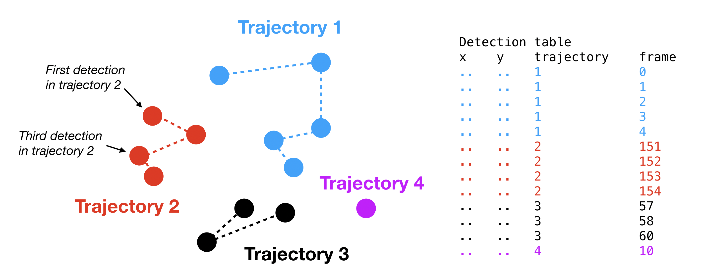

.. _input_format_label:

Note on input format
====================

saspt expects input trajectories as a large table of spatiotemporal coordinates.
Each coordinate represents the detection of a single fluorescent emitter, and is 
associated with a *trajectory index* that has been assigned by a tracking algorithm.
An example is shown in the figure below.

    Example of a table of detections. Each dot represents a detection and the dotted
    lines represent connections ("jumps") between detections in the same trajectory.
    Notice that the trajectories may contain "gaps", or missing frame indices, as in
    the case of trajectory 3.

The detection table (usually as a CSV) is the format expected by ``saspt``.
This format was chosen for simplicity.

``saspt`` comes with an example of the kind of input it expects:

.. code-block:: python

    >>> from saspt import sample_detections
    >>> detections = sample_detections()
    >>> print(detections)
                  y           x  frame  trajectory
    0    575.730202   84.828673      0       13319
    1    538.416604  485.924667      0        1562
    2    107.647631   61.892363      0         363
    ..          ...         ...    ...         ...
    493  366.475688   70.559735    297       14458
    494  363.350134   67.585339    298       14458
    495  360.006572   70.511980    299       14458

    [496 rows x 4 columns]

The XY coordinates in **pixels**.

These can then be used to construct the objects that ``saspt`` expects (see
the class hierarchy at :ref:`api_label`):

.. code-block:: python

    >>> from saspt import TrajectoryGroup, StateArrayParameters, StateArray, make_likelihood, RBME
    >>> settings = dict(likelihood_type = RBME, pixel_size_um = 0.16, frame_interval = 0.00748)
    >>> params = StateArrayParameters(**settings)
    >>> trajectories = TrajectoryGroup(detections, **settings)
    >>> likelihood = make_likelihood(**settings)
    >>> SA = StateArray(trajectories, likelihood, params)
    >>> print(params)
    StateArrayParameters:
      pixel_size_um:    0.16
      frame_interval:   0.00748
      focal_depth:  inf
      splitsize:    10
      sample_size:  10000
      start_frame:  0
      max_iter: 200
      conc_param:   1.0

    >>> print(trajectories)
    TrajectoryGroup:
    n_detections:   434
    n_jumps:    370
    n_tracks:   64

    >>> print(SA)
    StateArray:
      likelihood_type   : rbme
      n_tracks          : 64
      n_jumps           : 370
      parameter_names   : ('diff_coef', 'loc_error')
      shape             : (101, 36)

Although this approach is explicit, it is usually easier to use one of the alternative constructors that produce a ``StateArray`` directly from a set of detections:

.. code-block:: python

    >>> SA = StateArray.from_detections(detections, **settings)

This executes exactly the same steps implicitly:

.. code-block:: python

    >>> print(SA)
    StateArray:
      likelihood_type   : rbme
      n_tracks          : 64
      n_jumps           : 370
      parameter_names   : ('diff_coef', 'loc_error')
      shape             : (101, 36)