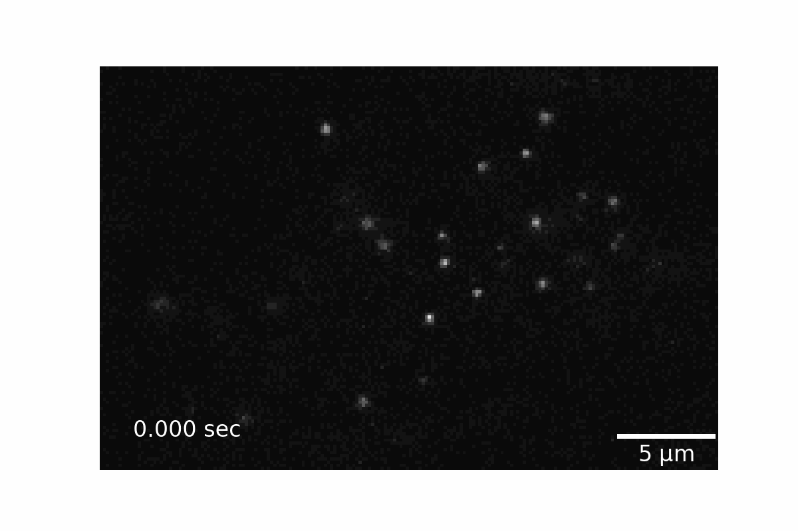
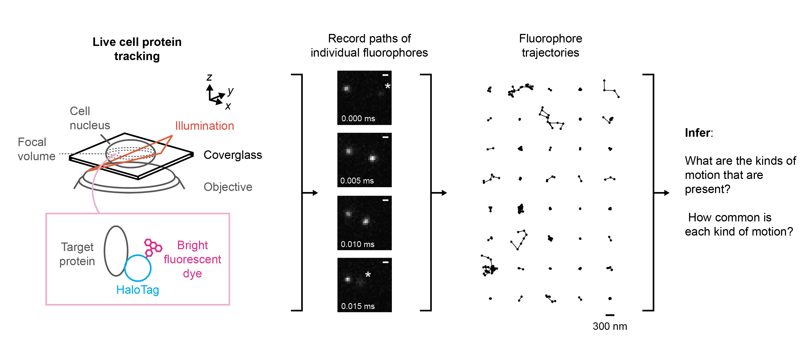
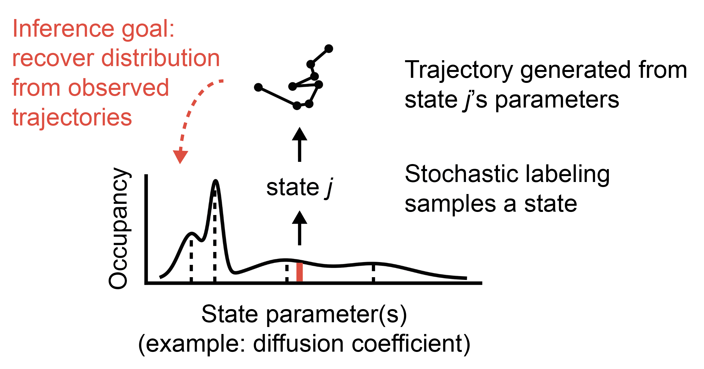

.. _description_label:

==========
Background
==========

We developed ``saspt`` to analyze a kind of high-speed microscopy called
*live cell protein tracking*. These experiments rely on fast, sensitive cameras to recover
the paths of fluorescently labeled protein molecules inside living cells.

The movie below is an example of a kind of protein tracking called SPT-PALM 
(`Manley et al. 2013 <https://dx.doi.org/10.1016%2FS0076-6879(10)75005-9>`_).
The microscope in this experiment is focused on a cell, but nearly all of the cell is 
invisible. The only part that we can see are bright little dots, each of which is a dye molecule
attached to a kind of protein called NPM1-HaloTag. Only a few of these dye molecules
are active at any given time. This keeps their density low enough to track their paths through
the cell.

    A short segment taken from an SPT-PALM movie in live U2OS osteosarcoma cells. Each bright dot is a single dye molecule covalently linked to an NPM1-HaloTag protein. The dye in this experiment is PA-JFX549, generously provided by the lab of Luke Lavis.

A quick glance reveals that not all molecules behave
the same way.
Some are nearly stationary; others wander rapidly around the cell. In ``saspt``, we refer to these
categories of behavior as *states*. In protein tracking, a major goal when applying tracking to a 
new protein target is to figure out 

    1. the number of distinct states the protein can occupy;
    2. the characteristics of each state (*state parameters*);
    3. the fraction of molecules in each state (*state occupations*).

Together, we refer to this information as a *model*.
The goal of ``saspt`` is to recover a model given some observed trajectories.
This specific kind of model, where we have a collection of observations from different states, is called a 
*mixture model*.

It's important to keep in mind that similar states can arise in distinct ways. For
example, a slow-moving state might indicate that the protein is interacting with an immobile scaffold
(like the cell membrane or DNA), or that it's simply too big to diffuse quickly in the crowded 
environment of the cell. Good SPT studies use biochemical perturbations - such as mutations or domain
deletions - to tease apart the molecular origins of each state.

    Schematic of the workflow for a live cell protein tracking experiment. A protein target is conjugated to a bright fluorescent label (in this case, a fluorescent dye molecule via a HaloTag domain). This label is then used to track the protein around inside the cell (*center*), producing a large set of short trajectories (*right*). A common goal in postprocessing is to use the set of trajectories to learn about the dynamics, or modes of mobility, exhibited by the protein target.

Model fitting vs. model selection
=================================

Approaches to analyze protein tracking data fall into one of two categories:
    
    1. *Model fitting*: we start with a known physical model. The goal is to fit the coefficients of that model given the observed data. Example: given a model with two Brownian states, recover the occupations and diffusion coefficients of each state.
    2. *Model selection*: we start with some uncertainty in the physical model (often, but not always, because we don't know the number of states). The goal of inference is to recover both the model and its coefficients.

Model selection is harder than model fitting. Some approaches, such as maximum likelihood inference, 
tend to exploit every degree of freedom we afford them in the model. As a result, when we increase model
complexity (by adding new states, for instance), we get better (higher likelihood) models. But this is 
mostly because they explain *noise* better, rather than intrinsic properties of the system. Such models 
generalize poorly to new data.

That's not very useful. Ideally we'd like to find the simplest model required to explain the observed data.
Simple models often yield more intelligible insights into underlying behavior and generalize more cleanly
to new data.

A key insight of early research into Bayesian methods was that such methods "pruned away" superfluous
complexity in a model, providing a natural mechanism for model selection. For instance, when
provided with a mixture model with a large number of states, 
Bayesian inference tends to drive the most state occupations to zero.
In the context of machine learning, this property is sometimes referred to 
as *automatic relevance determination* (ARD). A more familiar analogy may be Occam's razor: when two 
possible models can explain the data equally well, we favor the simpler one.

State arrays
============

The *state array* is the model that underlies the ``saspt`` package. It takes trajectories from
a protein tracking experiment and identifies a generative model for those trajectories, including
the number of distinct states, their characteristics, and their occupations.

To do so, it relies on a variational Bayesian inference routine that "prunes away" 
superfluous states on a large grid of possibilities, leading to minimal models that describe observed data.
It is particularly designed to deal with two limitations of protein tracking datasets:

    1. Trajectories are often very short, due to bleaching and defocalization. (See: :ref:`defocalization_label`)
    2. Apparent motion in tracking experiments can come from *localization error*, imprecision in the subpixel estimate of each emitter's position.
