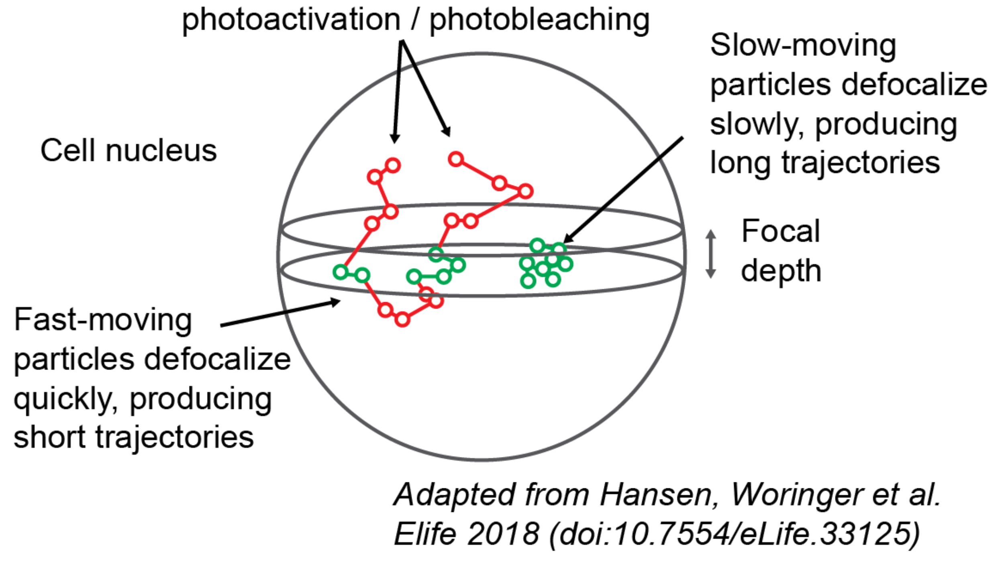

.. _faqs_label:

====
FAQS
====

.. _faq_tracking_label:

Q. Does ``saspt`` provide a way to do tracking?
===============================================

``saspt`` only analyzes the *output* of a tracking algorithm; it doesn't
produce the trajectories themselves. The general workflow is:

    1. Acquire some raw SPT movies
    2. Use a tracking algorithm to produce trajectories from the SPT movie
    3. Feed the trajectories into ``saspt`` (or whatever your favorite analysis tool is)

There are lots of good tracking algorithms out there.
In the sample data included in the ``saspt`` repo, we used an in-house tracking
tool with a graphic user interface (`quot <https://github.com/alecheckert/quot>`_). But - you know - we're biased.

Other popular options are `TrackMate <https://imagej.net/plugins/trackmate/>`_,
the `multiple-target tracing algorithm <https://pubmed.ncbi.nlm.nih.gov/18604216/>`_,
or `Sbalzerini's hill climbing algorithm <https://pubmed.ncbi.nlm.nih.gov/16043363/>`_. There are new tracking algorithms every day; use Google to see for yourself.

Q. Why doesn't ``saspt`` support input format *X*?
==================================================

Because a table of detections is probably the simplest format that
exists to describe trajectories, so we added it first. We're happy to 
expand support for additional formats (within reason) - let us know with
a GitHub request.

Q. Why are the default diffusion coefficients log-spaced?
=========================================================

As the diffusion coefficient increases, our estimate of it becomes much
more error-prone. This makes it difficult for humans to compare the occupations
of states with widely varying diffusion coefficients. By plotting on a log
scale, we minimize these perceptual differences so that humans can accurately 
compare states across the full range of biologically observed diffusion 
coefficients.

To demonstrate this effect, consider the likelihood function for
the jumps of a 2D Brownian motion with no localization error, diffusion coefficient
:math:`D`, frame interval :math:`\Delta t`, and :math:`n` total jumps. The 
maximum likelihood estimator for the diffusion coefficient is the mean-squared
displacement (MSD):

.. math::

    \hat{D} = \frac{1}{4 n \Delta t} \sum\limits_{j=1}^{n} (\Delta x_{j}^{2} + \Delta y_{j}^{2})

where :math:`(\Delta x_{j}, \Delta y_{j})` is the :math:`j^{\text{th}}` jump
in the trajectory.

We can get the "best-case" error in this estimate using the Cramer-Rao
lower bound (CRLB), which provides the minimum variance our estimator
:math:`\hat{D}`:

.. math::

    \text{Var}(\hat{D}) \geq \text{CRLB}(\hat{D}) = \frac{D^{2}}{n}

So the error in the estimate of :math:`D` actually increases as the
*square* of :math:`D`. If we throw in localization error (represented 
as the 1D spatial measurement variance, :math:`\sigma^{2}`) and neglect the
off-diagonal terms in the covariance matrix, we get the approximation

.. math::

    \text{Var}(\hat{D}) \geq \text{CRLB}(\hat{D}) \approx \frac{(D \Delta t + \sigma^{2})^{2}}{n \Delta t^{2}}

Notice that this makes it even *harder* to estimate the diffusion coefficient,
especially when :math:`D \Delta t < \sigma^{2}`. 

Q. How does ``saspt`` estimate the posterior occupations, given the posterior distribution?
===========================================================================================

``saspt`` always uses the posterior mean. If :math:`\boldsymbol{\alpha}` is the parameter to the posterior Dirichlet distribution over state occupations, then the posterior mean :math:`\boldsymbol{\tau}` is simply the normalized Dirichlet parameter:

.. math::

    \boldsymbol{\tau} \sim \text{Dirichlet} \left( \boldsymbol{\alpha} \right) \\
    \mathbb{E} \left[ \boldsymbol{\tau} | \boldsymbol{\alpha} \right] = \frac{1}{\sum_{j=1}^{K} \alpha_{j}} \begin{bmatrix}
        \alpha_{1} \\
        ...        \\
        \alpha_{K}
    \end{bmatrix}

We prefer the posterior mean to max *a posteriori* (MAP) or other estimators because
it is very conservative and minimizes the occurrence of spurious features.

Q. I want to measure the fraction of particles in a particular state. How do I do that?
=======================================================================================

If you know the range of diffusion coefficients you're interested in,
you can directly integrate the mean posterior occupations. Say we want 
the fraction of particles with diffusion coefficients between 1 and 10
:math:`\mu\text{m}^{2}`/sec:

.. code-block:: python

    >>> occupations = SA.posterior_occs_dataframe
    >>> in_range = (occupations['diff_coef'] >= 1.0) & (occupations['diff_coef'] < 10.0)
    >>> print(occupations.loc[in_range, 'mean_posterior_occupation'].sum())

That being said, ``saspt`` does *not* provide any way to determine the 
endpoints for this range, and that is up to you or the methods you develop.

.. _defocalization_label:

Q. What is defocalization?
==========================

Examining the movie in the section :ref:`description_label`, you may notice that the particles are constantly
wandering into and out of focus. The faster they move, the faster they escape the microscope's
focus.

As it turns out, this behavior (termed "defocalization") has a dangerous side effect. If we 
want to know the *state occupations* - the fraction of proteins in a particular state - 
we may be tempted to report the *fraction of observed trajectories in that state*.
The problem is that particles in fast
states contribute many short trajectories, because they can wander in and out of focus
multiple times before bleaching. By contrast, particles in slow states produce a
few long trajectories; they don't move fast enough to reenter the focal volume before bleaching.

As a result, a mixture of equal parts fast and slow particles does *not* produce
equal parts fast and slow trajectories.

    Illustration of the defocalization problem. Particles inside the focus (green circles) are recorded by the microscope; particles outside the focus (red circles) are not recorded. Particles that traverse the focus multiple times are "fragmented" into multiple short trajectories.

Defocalization is the reason why the "MSD histogram" method - one of the most popular
approaches to analyze protein tracking data - yields inaccurate results when applied to 
2D imaging. A more detailed discussion can be found in the papers
of `Mazza <https://doi.org/10.1093/nar/gks701>`_ and 
`Hansen and Woringer <https://doi.org/10.7554/eLife.33125.001>`_.

``saspt`` avoids the state estimation problem by computing state occupations in terms of *jumps*
rather than trajectories. Additionally, an analytical correction factor (analogous to the empirical
correction factor from `Hansen and Woringer <https://doi.org/10.7554/eLife.33125.001>`_) can be 
applied to the data by passing the ``focal_depth`` parameter when constructing a ``StateArray``
or ``StateArrayDataset`` object.