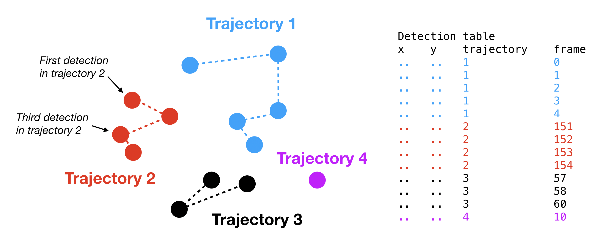

.. _getting_started_label:

===============
Getting started
===============

.. note::

    Before running, see :ref:`install_label` for installation instructions.

This is a quick guide to getting started with ``saspt``. It assumes you're familiar
with single particle tracking (SPT).
For a more detailed explanation of ``saspt``'s purpose, range of applicability, and
statistical model, see :ref:`description_label`.

``saspt`` is a tool for finding plausible physical models for single particle tracking
(SPT) datasets. SPT measures the paths of fluorescently labeled
particles at regular intervals; we call these paths *trajectories*.

One of the simplest formats to store trajectories is a large table of coordinates.
Each coordinate represents the detection of a single fluorescent emitter, and is 
associated with a *trajectory index* that has been assigned by a tracking algorithm.
An example is shown in the figure below.

    Example of a table of detections. Each dot represents a detection and the dotted
    lines represent connections ("jumps") between detections in the same trajectory.
    Notice that the trajectories may contain "gaps", or missing frame indices, as in
    the case of trajectory 3.

The detection table (usually as a CSV) is the format expected by ``saspt``.
It was chosen for its simplicity; the output of pretty much any tracking algorithm 
can be quickly converted to a detection CSV.

``saspt`` comes with a small toy set of detections that we'll use for these examples:

.. code-block:: python

    >>> import pandas as pd, numpy as np, saspt
    >>> detections = saspt.sample_detections()
    >>> print(detections)
                  y           x  frame  trajectory
    0    575.730202   84.828673      0       13319
    1    538.416604  485.924667      0        1562
    2    107.647631   61.892363      0         363
    ..          ...         ...    ...         ...
    493  366.475688   70.559735    297       14458
    494  363.350134   67.585339    298       14458
    495  360.006572   70.511980    299       14458

    [496 rows x 4 columns]

To create
