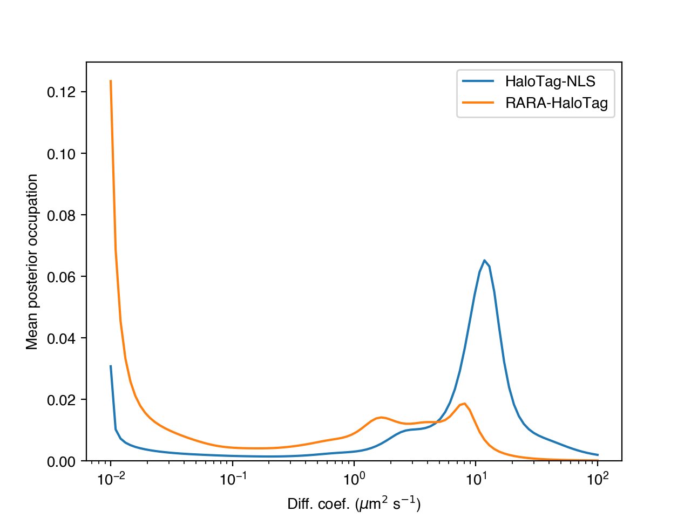

.. _quickstart_label:

==========
Quickstart
==========

.. note::

    Before running, see :ref:`install_label` for installation instructions.

.. note::

    Want more code and less prose? Check out `examples.py <https://github.com/alecheckert/saspt/blob/main/examples/examples.py>`_, a simple executable that demos most of stuff in this Quickstart.

This is a quick guide to getting started with ``saspt``. It assumes you're familiar
with single particle tracking (SPT), have seen mixture models before, and have 
installed ``saspt``.
For a more detailed explanation of ``saspt``'s purpose, model, and range of applicability,
see :ref:`description_label`.

Run state arrays on a single SPT experiment
===========================================

We'll use the sample set of trajectories that comes with ``saspt``:

.. code-block:: python

    >>> import pandas as pd, numpy as np, matplotlib.pyplot as plt
    >>> from saspt import sample_detections, StateArray, RBME
    >>> detections = sample_detections()

(The expected format for input trajectories is described under :ref:`input_format_label`.)

Next, we'll set the parameters for a state array that uses mixtures of regular Brownian
motions with localization error (RBMEs):

.. code-block:: python

    >>> settings = dict(
    ...     likelihood_type = RBME,
    ...     pixel_size_um = 0.122,
    ...     frame_interval = 0.01,
    ...     focal_depth = 0.7,
    ...     progress_bar = True,
    ... )

Only three parameters are actually required:

    * ``likelihood_type``: the type of physical model to use
    * ``pixel_size_um``: size of camera pixels after magnification in microns
    * ``frame_interval``: time between frames in seconds

Additionally, we've set the ``focal_depth``, which accounts for the finite focal depth of 
high-NA objectives used for SPT experiments, and ``progress_bar``, which shows progress
during inference. A full list of parameters and their meaning is described at :ref:`statearrayparameters_label`.

Construct a ``StateArray`` with these settings:

.. code-block:: python

    >>> SA = StateArray.from_detections(detections, **settings)

If we run ``print(SA)``, we get

.. code-block:: python

    StateArray:
      likelihood_type   : rbme
      n_tracks          : 1130
      n_jumps           : 3933
      parameter_names   : ('diff_coef', 'loc_error')
      shape             : (100, 36)

This means that this state array infers occupations on a 2D parameter grid of diffusion coefficient
(``diff_coef``) and localization error (``loc_error``), using 1130 trajectories. The shape of the 
parameter grid is ``(100, 36)``, meaning that the grid uses 100 distinct diffusion coefficients
and 36 distinct localization errors (the default). These define the range of physical models that can be 
described with this state array. We can get the values of these parameters using the 
``StateArray.parameter_values`` attribute:

.. code-block:: python

    >>> diff_coefs, loc_errors = SA.parameter_values
    >>> print(diff_coefs.shape)
    (100,)
    >>> print(loc_errors.shape)
    (36,)

The ``StateArray`` object provides two estimates of the state occupations at each point on 
this parameter grid:

    * The "naive" estimate, a quick and dirty estimate from the raw likelihood function
    * The "posterior" estimate, which uses the full state array model

The posterior estimate is more precise than the naive estimate, but also requires more
trajectories and time. The more trajectories are present in the input, the more precise
the posterior estimate becomes.

The ``StateArray`` object provides a built-in plot to compare the naive and posterior
estimates:

.. code-block:: python

    >>> SA.plot_occupations("rbme_occupations.png")

The plot will look something like this:

The bottom row shows the posterior occupations marginalized on diffusion coefficient. This is 
a simple and powerful mechanism to account for the influence of localization error.

In this case, the state array identified a dominant diffusive state with a diffusion coefficient
of about 5 :math:`\mu \text{m}^{2}`/sec.
We can also see a less-populated state between about 1 and 3 :math:`\mu \text{m}^{2}`/sec,
and some very slow particles with diffusion coefficients in the range 0.01 to 0.1
:math:`\mu \text{m}^{2}`/sec.

We can retrieve the raw arrays used in this plot via the ``naive_occs`` and ``posterior_occs``
attributes. Both are arrays defined on the same grid of diffusion coefficient vs. localization error:

.. code-block:: python

    >>> naive_occs = SA.naive_occs
    >>> posterior_occs = SA.posterior_occs
    >>> print(naive_occs.shape)
    (100, 36)
    >>> print(posterior_occs.shape)
    (100, 36)

Along with the state occupations, the ``StateArray`` object also infers the
probabilities of each *trajectory-state assignment*. As with the state occupations,
the trajectory-state assignment probabilities have both "naive" and "posterior"
versions that we can compare:

.. code-block:: python

    >>> naive_assignment_probabilities = SA.naive_assignment_probabilities
    >>> posterior_assignment_probabilities = SA.posterior_assignment_probabilities
    >>> print(naive_assignment_probabilities.shape)
    (100, 36, 1130)
    >>> print(posterior_assignment_probabilities.shape)
    (100, 36, 1130)

Notice that these arrays have one element per point in our 100-by-36 parameter grid
and per trajectory. For example, the marginal probability that trajectory 100 has 
each of the 100 diffusion coefficients is:

.. code-block:: python

    >>> posterior_assignment_probabilities[:,:,100].sum(axis=1)

``StateArray`` provides a plot to compare the naive and posterior assignment
probabilities across all trajectories:

.. code-block:: python

    >>> SA.plot_assignment_probabilities('rbme_assignment_probabilities.png')

Each column in this plot represents a single trajectory, and the rows represent the
probability of the trajectories having a particular diffusion coefficient. (The 
trajectories are sorted by their posterior mean diffusion coefficient.)

There are also a couple of related plots (not illustrated here):
    * :py:meth:`saspt.StateArray.plot_temporal_assignment_probabilities`: shows the assignment probabilities as a function of the frame(s) in which the respective trajectories were found
    * :py:meth:`saspt.StateArray.plot_spatial_assignment_probabilities`: shows the assignment probabilities as a function of the spatial location of the component detections

Finally, ``StateArray`` provides the naive and posterior state occupations as a 
``pandas.DataFrame``:

.. code-block:: python

    >>> occupations = SA.occupations_dataframe
    >>> print(occupations)
          diff_coef  loc_error  naive_occupation  mean_posterior_occupation
    0          0.01      0.000          0.000017                   0.000009
    1          0.01      0.002          0.000017                   0.000008
    2          0.01      0.004          0.000016                   0.000008
    ...         ...        ...               ...                        ...
    3597     100.00      0.066          0.000042                   0.000014
    3598     100.00      0.068          0.000041                   0.000014
    3599     100.00      0.070          0.000041                   0.000014

    [3600 rows x 4 columns]

Each row corresponds to a single point on the parameter grid. For instance, if
we wanted to get the probability that a particle has a diffusion coefficient 
less than 0.1 :math:`\mu \text{m}^{2}`/sec, we could do:

.. code-block:: python

    >>> selected = occupations['diff_coef'] < 0.1
    >>> naive_estimate = occupations.loc[selected, 'naive_occupation'].sum()
    >>> posterior_estimate = occupations.loc[selected, 'mean_posterior_occupation'].sum()
    >>> print(naive_estimate)
    0.24171198737935867
    >>> print(posterior_estimate)
    0.2779671727562628

In this case, the naive and posterior estimates are quite similar.

Run state arrays on a SPT dataset
=================================

Often we want to run state arrays on more than one SPT experiment and compare the 
output between experimental conditions. The ``StateArrayDataset`` object is intended to
be a simple solution that provides:

    * methods to parallelize state array inference across multiple SPT experiments
    * outputs and visualizations to help compare between experimental conditions

In this example, we'll use an `example <https://github.com/alecheckert/saspt/tree/main/examples>`_
from the `saspt repo <https://github.com/alecheckert/saspt>`_. 
You can follow along by cloning the ``saspt`` repo and navigating to
the ``examples`` subdirectory:

.. code-block:: bash

    $ git clone https://github.com/alecheckert/saspt.git
    $ cd saspt/examples
    $ ls -1
    examples.py
    experiment_conditions.csv
    u2os_ht_nls_7.48ms
    u2os_rara_ht_7.48ms

The ``examples`` subdirectory contains a small SPT dataset where two proteins have been tracked:
    * ``HT-NLS``: HaloTag (HT) fused to a nuclear localization signal (NLS), labeled with the photoactivatable fluorescent dye PA-JFX549
    * ``RARA-HT``: retinoic acid receptor :math:`\alpha` (RARA) fused to HaloTag (HT), labeled with the photoactivatable fluorescent dye PA-JFX549

Each protein has 11 SPT experiments, stored as CSV files in the ``examples/u2os_ht_nls_7.48ms`` and 
``examples/u2os_rara_ht_7.48ms`` subdirectories. We also have a registry file (``experiment_conditions.csv``) that contains the assignment of each file to an experimental condition:

.. code-block:: python

    >>> paths = pd.read_csv('experiment_conditions.csv')

In this case, we have two columns: ``filepath`` encodes the path to the CSV corresponding
to each SPT experiment, while ``condition`` encodes the experimental condition. (It doesn't
actually matter what these are named as long as they match the ``path_col`` and ``condition_col``
parameters below.)

.. code-block:: python

    >>> print(paths)
                                          filepath     condition
    0    u2os_ht_nls_7.48ms/region_0_7ms_trajs.csv   HaloTag-NLS
    1   u2os_ht_nls_7.48ms/region_10_7ms_trajs.csv   HaloTag-NLS
    2    u2os_ht_nls_7.48ms/region_1_7ms_trajs.csv   HaloTag-NLS
    ..                                         ...           ...
    19  u2os_rara_ht_7.48ms/region_7_7ms_trajs.csv  RARA-HaloTag
    20  u2os_rara_ht_7.48ms/region_8_7ms_trajs.csv  RARA-HaloTag
    21  u2os_rara_ht_7.48ms/region_9_7ms_trajs.csv  RARA-HaloTag

    [22 rows x 2 columns]

Specify some parameters related to this analysis:

.. code-block:: python

    >>> settings = dict(
    ...     likelihood_type = RBME,
    ...     pixel_size_um = 0.16,
    ...     frame_interval = 0.00748,
    ...     focal_depth = 0.7,
    ...     path_col = 'filepath',
    ...     condition_col = 'condition',
    ...     progress_bar = True,
    ...     num_workers = 6,
    ... )

.. warning::

    The ``num_workers`` attribute specifies the number of parallel processes to use when 
    running inference. Don't set this higher than the number of CPUs on your computer, or
    you're likely to suffer performance hits.

Create a ``StateArrayDataset`` with these settings:

.. code-block:: python

    >>> from saspt import StateArrayDataset
    >>> SAD = StateArrayDataset.from_kwargs(paths, **settings)

If you do ``print(SAD)``, you'll get some basic info on this dataset:

.. code-block:: python

    >>> print(SAD)
    StateArrayDataset:
      likelihood_type    : rbme
      shape              : (100, 36)
      n_files            : 22
      path_col           : filepath
      condition_col      : condition
      conditions         : ['HaloTag-NLS' 'RARA-HaloTag']

We can get more detailed information on these experiments (such as the detection density,
mean trajectory length, etc.) by accessing the ``raw_track_statistics`` attribute:

.. code-block:: python
    
    >>> stats = SAD.raw_track_statistics
    >>> print(stats)
        n_tracks  n_jumps  ...                                    filepath     condition
    0       2387     1520  ...   u2os_ht_nls_7.48ms/region_0_7ms_trajs.csv   HaloTag-NLS
    1       4966     5341  ...  u2os_ht_nls_7.48ms/region_10_7ms_trajs.csv   HaloTag-NLS
    2       3294     2584  ...   u2os_ht_nls_7.48ms/region_1_7ms_trajs.csv   HaloTag-NLS
    ..       ...      ...  ...                                         ...           ...
    19      5418    13129  ...  u2os_rara_ht_7.48ms/region_7_7ms_trajs.csv  RARA-HaloTag
    20      9814    26323  ...  u2os_rara_ht_7.48ms/region_8_7ms_trajs.csv  RARA-HaloTag
    21      7530    18978  ...  u2os_rara_ht_7.48ms/region_9_7ms_trajs.csv  RARA-HaloTag

    [22 rows x 13 columns]
    >>> print(stats.columns)
    Index(['n_tracks', 'n_jumps', 'n_detections', 'mean_track_length',
           'max_track_length', 'fraction_singlets', 'fraction_unassigned',
           'mean_jumps_per_track', 'mean_detections_per_frame',
           'max_detections_per_frame', 'fraction_of_frames_with_detections',
           'filepath', 'condition'],
          dtype='object')

To get the naive and posterior state occupations for each file in this dataset:

.. code-block:: python

    >>> marginal_naive_occs = SAD.marginal_naive_occs
    >>> marginal_posterior_occs = SAD.marginal_posterior_occs
    >>> print(marginal_naive_occs.shape)
    >>> print(marginal_posterior_occs.shape)

.. note::
    
    It can take a few minutes to compute the posterior occupations for a dataset of
    this size. If you need a quick estimate for a test, try reducing the ``max_iter``
    or ``sample_size`` parameters.

These occupations are "marginal" in the sense that they've been marginalized onto the 
parameter of interest in most SPT experiments: the diffusion coefficient. (You can 
get the original, unmarginalized occupations via the ``StateArrayDataset.posterior_occs``
and ``StateArrayDataset.naive_occs`` attributes.)

The same information is also provided as a ``pandas.DataFrame``:

.. code-block:: python

    >>> occupations = SAD.marginal_posterior_occs_dataframe

For example, imagine we want to calculate the posterior probability that a particle had
a diffusion coefficient less than 0.5 :math:`\mu\text{m}^{2}`/sec for each file. We could
do this by taking

.. code-block:: python

    >>> print(occupations.loc[occupations['diff_coef'] < 0.5].groupby(
    ...   'filepath')['mean_posterior_occupation'].sum())
    filepath
    u2os_ht_nls_7.48ms/region_0_7ms_trajs.csv      0.188782
    u2os_ht_nls_7.48ms/region_10_7ms_trajs.csv     0.103510
    u2os_ht_nls_7.48ms/region_1_7ms_trajs.csv      0.091148
    ...
    u2os_rara_ht_7.48ms/region_7_7ms_trajs.csv     0.579444
    u2os_rara_ht_7.48ms/region_8_7ms_trajs.csv     0.553111
    u2os_rara_ht_7.48ms/region_9_7ms_trajs.csv     0.650187
    Name: posterior_occupation, dtype: float64

The ``StateArrayDataset`` provides a few plots to visualize these occupations:

.. code-block:: python

    >>> SAD.posterior_heat_map('posterior_heat_map.png')

Notice that the two kinds of proteins have different diffusive profiles: HaloTag-NLS
occupies a narrow range of diffusion coefficients centered around 10 :math:`\mu \text{m}^{2}`/sec,
while RARA-HaloTag has a much broader range of free diffusion coefficients with a substantial
immobile fraction (showing up at the lower end of the diffusion coefficient range). 

The heat map plot is useful to judge how consistent the result is across SPT experiments in 
the same condition. We can also compare the variability using an alternative line plot 
representation:

.. code-block:: python

    >>> SAD.posterior_line_plot('posterior_line_plot.png')

.. code-block:: python

    >>> SAD.naive_heat_map('naive_heat_map.png')

Notice that the information provided by the naive occupations is qualitatively similar but less precise
than the posterior occupations.

.. code-block:: python

    >>> SAD.naive_line_plot('naive_line_plot.png')

Additionally, rather than performing state array inference on each file individually,
we can aggregate trajectories across all files matching a particular condition:

.. code-block:: python

    >>> posterior_occs, condition_names = SAD.infer_posterior_by_condition('condition')
    >>> print(posterior_occs.shape)
    (2, 100)
    >>> print(condition_names)
    ['HaloTag-NLS', 'RARA-HaloTag']

The results are unnormalized (they reflect the total number of jumps in each condition).
We can normalize and plot the results by doing:

.. code-block:: python

    >>> from saspt import normalize_2d
    >>> posterior_occs = normalize_2d(posterior_occs, axis=1)
    >>> diff_coefs = SAD.likelihood.diff_coefs
    >>> for c in range(posterior_occs.shape[0]):
    ...     plt.plot(diff_coefs, posterior_occs[c,:], label=condition_names[c])
    >>> plt.xscale('log')
    >>> plt.xlabel('Diff. coef. ($\mu$m$^{2}$ s$^{-1}$)')
    >>> plt.ylabel('Mean posterior occupation')
    >>> plt.ylim((0, plt.ylim()[1]))
    >>> plt.legend()
    >>> plt.show()

The more trajectories we aggregate, the better our state occupation estimates
become. ``saspt`` performs best when using large datasets with tens of thousands of 
trajectories per condition.
